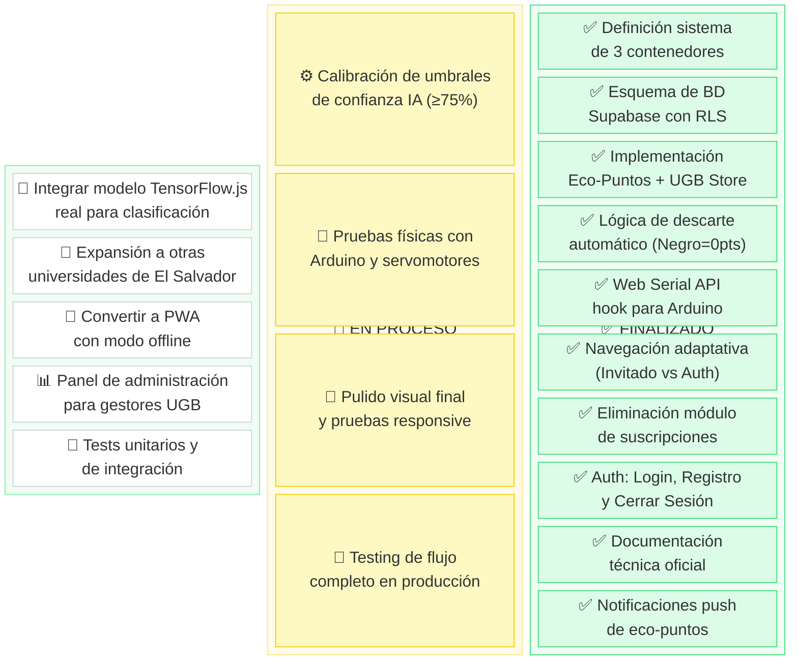
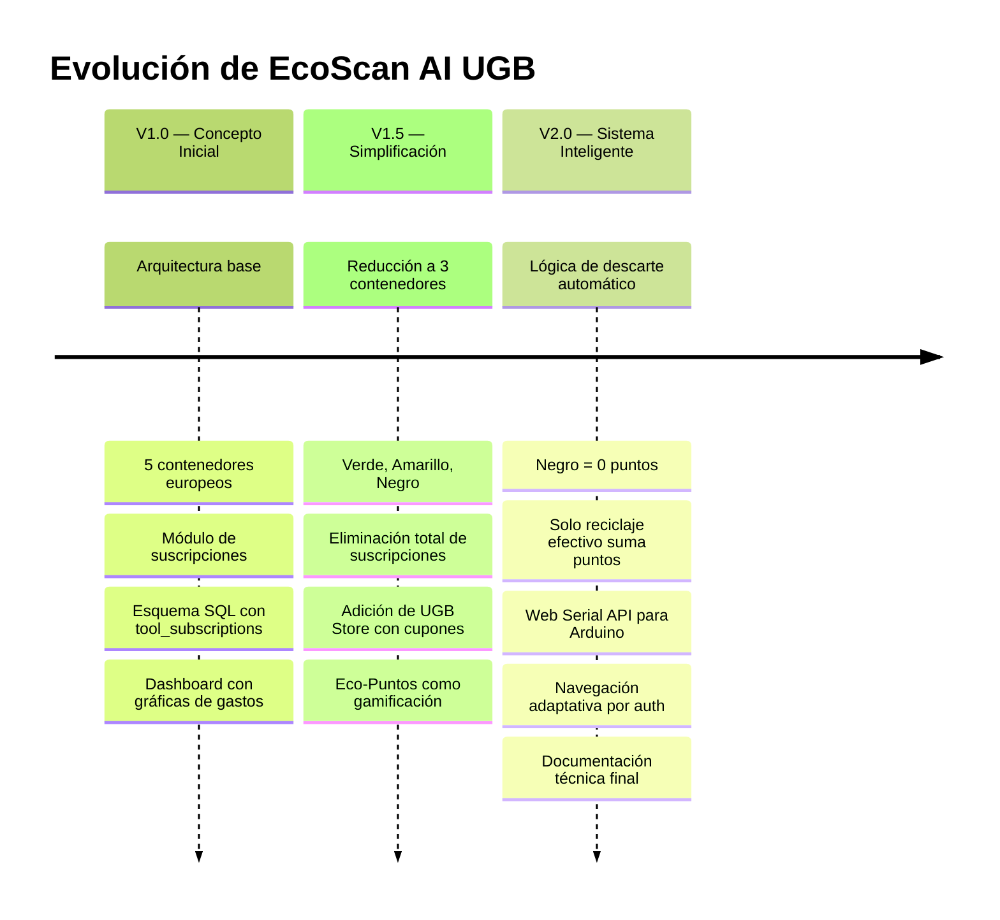

# 📄 EcoScan AI — Documentación Oficial del Proyecto

> **Universidad Gerardo Barrios (UGB)**
> Asignatura: Tecnología Emergente
> Versión: 2.0 — Sistema Inteligente de 3 Vías
> Fecha: Febrero 2026

---

## Tabla de Contenidos

1. [Introducción y Propósito Social](#1-introducción-y-propósito-social)
2. [Análisis del Problema y Justificación](#2-análisis-del-problema-y-justificación)
3. [Evolución y Control de Cambios](#3-evolución-y-control-de-cambios)
4. [Arquitectura Técnica y Hardware](#4-arquitectura-técnica-y-hardware)
5. [Experiencia de Usuario (UX/UI)](#5-experiencia-de-usuario-uxui)
6. [Sistema de Eco-Puntos y UGB Store](#6-sistema-de-eco-puntos-y-ugb-store)
7. [Fases del Proyecto](#7-fases-del-proyecto)
8. [Estructura de Archivos](#8-estructura-de-archivos)
9. [Esquema de Base de Datos](#9-esquema-de-base-de-datos)
10. [Guía de Despliegue](#10-guía-de-despliegue)
11. [Tablero Kanban del Proyecto](#11-tablero-kanban-del-proyecto)

---

## 1. Introducción y Propósito Social

### ¿Qué es EcoScan AI?

**EcoScan AI** no es únicamente una aplicación de software; es una **iniciativa de sostenibilidad ambiental** nacida dentro de la Universidad Gerardo Barrios con el objetivo de transformar la manera en que la comunidad estudiantil interactúa con el reciclaje.

El proyecto integra **inteligencia artificial**, **hardware con Arduino** y **gamificación** para crear un ecosistema donde reciclar correctamente se convierte en una actividad gratificante y educativa.

### Visión

Construir una cultura de reciclaje inteligente en la UGB que pueda servir como **modelo de referencia interuniversitario**, demostrando que la tecnología puede ser un catalizador del cambio ambiental en instituciones educativas de El Salvador y Centroamérica.

### Público Objetivo

| Segmento | Rol en el Ecosistema |
|---|---|
| **Estudiantes UGB** | Usuarios principales — escanean, reciclan y ganan puntos |
| **Administración UGB** | Gestionan la UGB Store y los incentivos |
| **Personal de Limpieza** | Se benefician de la clasificación previa de residuos |
| **Comunidad Académica** | Modelo replicable para otras universidades |

---

## 2. Análisis del Problema y Justificación

### El Problema

En el campus de la UGB, como en muchas instituciones educativas, se identificaron tres problemas críticos:

1. **Confusión en la clasificación:** Los estudiantes no distinguen con seguridad qué tipo de residuo va en cada contenedor, lo que genera contaminación cruzada.
2. **Falta de incentivos:** No existe una motivación tangible para que los estudiantes se esfuercen en reciclar correctamente. El reciclaje se percibe como una obligación, no como una oportunidad.
3. **Ausencia de tecnología:** Los contenedores tradicionales no ofrecen retroalimentación ni guía al usuario, desperdiciando el potencial de la tecnología disponible.

### La Solución: EcoScan AI

EcoScan AI aborda estos tres problemas simultáneamente:

| Problema | Solución EcoScan AI |
|---|---|
| Confusión en clasificación | **IA con visión artificial** que identifica el residuo y abre automáticamente la compuerta correcta |
| Falta de incentivos | Sistema de **Eco-Puntos** canjeables por cupones de descuento en la **UGB Store** |
| Ausencia de tecnología | Contenedores inteligentes con **Arduino**, servomotores y comunicación vía **Web Serial API** |

---

## 3. Evolución y Control de Cambios

El proyecto sufrió transformaciones estratégicas significativas durante su desarrollo. Esta bitácora documenta cada decisión y su justificación.

### 3.1 Simplificación de Categorías: De 5 a 3 Contenedores

#### Versión 1.0 (Inicial) — 5 Contenedores

El diseño original contemplaba cinco categorías de clasificación basadas en sistemas de reciclaje europeos:

| Color | Material | Complejidad |
|---|---|---|
| Amarillo | Plásticos y Envases | Media |
| Verde | Vidrio | Alta |
| Marrón | Orgánico | Media |
| Gris/Blanco | Resto General | Baja |
| Rojo | Peligrosos (pilas, aceite) | Muy Alta |

#### Versión 2.0 (Final) — 3 Contenedores

Se determinó que 5 categorías era excesivo para el contexto universitario y que un sistema más simple tendría mayor adopción y menor margen de error:

| Color | Material | Señal Arduino | Eco-Puntos |
|---|---|---|---|
| 🟢 Verde | Botellas de Plástico | `P` | +15 ⭐ |
| 🟡 Amarillo | Latas de Aluminio | `L` | +20 ⭐ |
| ⚫ Negro | Basura Común (Descarte) | `C` | 0 |

**Justificación:**
- **Simplicidad de uso:** 3 opciones son cognitivamente más fáciles que 5.
- **Viabilidad de hardware:** Menos servomotores, menos costo, más fiabilidad.
- **Residuos más frecuentes en campus:** Botellas de plástico y latas representan la mayoría de residuos reciclables generados por estudiantes.

---

### 3.2 Cambio de Enfoque Funcional: Eliminación de Suscripciones

#### Versión 1.0

El diseño original incluía un módulo completo de **gestión de suscripciones y gastos** (tabla `tool_subscriptions`) con gráficas de desglose por categoría, ciclos de facturación, y gestión de renovaciones. Esto respondía a un planteamiento genérico de "aplicación de productividad".

#### Versión 2.0

Se eliminó completamente este módulo para centrar la aplicación en su verdadero propósito: **impacto ambiental y recompensas estudiantiles**.

**Justificación:**
- La gestión de suscripciones no tiene relación con el reciclaje ni con el público objetivo (estudiantes).
- Añadía complejidad innecesaria a la base de datos y a la interfaz.
- El espacio liberado se utilizó para el sistema de **UGB Store** (cupones canjeables por eco-puntos), que sí genera un incentivo directo para reciclar.

**Elementos eliminados:**
- Tabla `tool_subscriptions`
- Componentes `SpendingChart.tsx` y `SubscriptionList.tsx`
- Gráficas de gastos (`Recharts`)
- Toda referencia a presupuestos o facturación

**Elementos añadidos en su lugar:**
- Tabla `ugb_coupons`
- Catálogo de cupones UGB Store
- Sección de canje en el Dashboard

---

### 3.3 Lógica de Descarte Automático

Esta fue la iteración más importante de la lógica de clasificación.

#### Problema Detectado en V1.0

En la versión original, la IA intentaba clasificar cada residuo en una de las 5 categorías. Si el objeto no era reconocido, el flujo se detenía y el usuario no sabía qué hacer.

#### Solución Implementada en V2.0: Descarte Automático

Se implementó un sistema de **3 vías con descarte inteligente**:

```
┌──────────────────────────────────────────┐
│           OBJETO ESCANEADO               │
└─────────────────┬────────────────────────┘
                  │
          ┌───────▼────────┐
          │ ¿Es Plástico?  │
          │ (confianza ≥75%)│
          └───┬────────┬───┘
            Sí │        │ No
              │        │
     ┌────────▼──┐  ┌──▼────────────┐
     │  VERDE    │  │ ¿Es Lata?     │
     │  +15 pts  │  │ (confianza    │
     │  Serial:P │  │  ≥75%)        │
     └───────────┘  └──┬────────┬───┘
                     Sí │        │ No
                       │        │
              ┌────────▼──┐  ┌──▼───────────┐
              │ AMARILLO  │  │    NEGRO     │
              │  +20 pts  │  │ DESCARTE     │
              │  Serial:L │  │ AUTOMÁTICO   │
              └───────────┘  │    0 pts     │
                             │  Serial:C    │
                             └──────────────┘
```

**Reglas de decisión:**
1. Si la IA detecta **Botella de Plástico** con confianza ≥75% → Contenedor **Verde** → +15 puntos.
2. Si la IA detecta **Lata de Aluminio** con confianza ≥75% → Contenedor **Amarillo** → +20 puntos.
3. Si el objeto **no corresponde** a ninguna de las anteriores, o la confianza es baja → **Descarte automático** al contenedor **Negro** → 0 puntos.

**Comportamiento de la interfaz en descarte:**
- Se muestra: *"⚠️ Residuo no identificado como reciclable. Por favor, deposítelo en el contenedor de Basura Común."*
- El contenedor Negro se abre automáticamente (señal `C` al Arduino).
- No se otorgan eco-puntos, pero sí se registra el escaneo en el historial.

---

## 4. Arquitectura Técnica y Hardware

### 4.1 Stack Tecnológico

| Capa | Tecnología | Propósito |
|---|---|---|
| **Frontend** | Next.js 14 (App Router) | Framework React con SSR y rutas de archivo |
| **Estilos** | Tailwind CSS | Diseño responsivo con utilidades |
| **Backend/BaaS** | Supabase | PostgreSQL, Auth, Row Level Security |
| **Hardware** | Arduino + Servomotores | Control de compuertas físicas |
| **Comunicación** | Web Serial API | Puente navegador ↔ Arduino |
| **Despliegue** | Docker + VPS | Contenedorización y hosting |

### 4.2 Integración de Hardware (Web Serial API)

La aplicación web se comunica directamente con un Arduino conectado por USB mediante la **Web Serial API**, disponible en Chrome y Edge.

#### Flujo de Comunicación

```
┌─────────────┐      USB/Serial       ┌──────────────┐
│  Navegador  │  ──── 9600 baud ────> │   Arduino    │
│  (Chrome)   │      Caracteres:      │   (UNO/Nano) │
│             │      'P', 'L', 'C'    │              │
└─────────────┘                       └──────┬───────┘
                                             │
                                    ┌────────▼────────┐
                                    │  Servomotores   │
                                    │  (3 compuertas) │
                                    └─────────────────┘
```

#### Señales de Control

| Señal | Carácter | Acción del Arduino | Contenedor |
|---|---|---|---|
| Plástico | `P` | Gira servo 1 a 90° por 3 segundos | 🟢 Verde |
| Lata | `L` | Gira servo 2 a 90° por 3 segundos | 🟡 Amarillo |
| Común | `C` | Gira servo 3 a 90° por 3 segundos | ⚫ Negro |

#### Implementación en el Código

El hook `useSerial.ts` encapsula toda la lógica de conexión:
1. El usuario presiona **"Conectar Arduino"** → se abre un diálogo del navegador para seleccionar el puerto COM.
2. Se establece la conexión a **9600 baudios**.
3. Tras cada escaneo, se envía automáticamente el carácter correspondiente (`P`, `L` o `C`).
4. La interfaz muestra el estado de conexión en tiempo real.

> **Nota:** Si el Arduino no está conectado, la clasificación funciona normalmente pero sin apertura física de compuertas. Esto permite usar la app en modo solo-software para fines de demostración.

---

## 5. Experiencia de Usuario (UX/UI)

### 5.1 Navegación Adaptativa por Estado de Autenticación

| Estado | Vista Principal | Navegación |
|---|---|---|
| **Invitado** (no autenticado) | Landing Page con información del proyecto | Links a Login / Registro |
| **Estudiante** (autenticado) | Dashboard con eco-puntos y historial | Links a Dashboard / Escáner / Cerrar Sesión |

### 5.2 Estética: "Naturaleza y Futuro"

El diseño visual sigue una filosofía orgánica y moderna:

- **Paleta de colores:** Verdes orgánicos (`#2D4F1E`, `#4A7C34`, `#6B9B4E`), crema (`#F5F1EB`), blancos puros.
- **Tipografía:** Google Fonts **Inter** — limpia, moderna y altamente legible.
- **Bordes:** `rounded-2xl` y `rounded-3xl` para un aspecto suave y amigable.
- **Efectos:** Glassmorphism en la barra de navegación, micro-animaciones en hover, y transiciones suaves entre estados.
- **Componentes tipo Card:** Sombras sutiles (`shadow-sm`, `shadow-lg`), fondos blancos con bordes delgados.

### 5.3 Vistas Principales

#### Landing Page (Invitado)
- Hero con mensaje de impacto y botones de acción.
- Sección de 3 contenedores con puntos y señales Arduino.
- Flujo de "Cómo funciona" en 4 pasos.
- Call-to-Action con gradiente verde.
- Footer institucional UGB.

#### Dashboard (Autenticado)
- Tarjeta de saldo de Eco-Puntos con gradiente.
- Botón de acceso directo al escáner.
- Contadores por tipo de material (Plástico / Lata / Común).
- Historial de reciclaje con fecha, material y puntos.
- Sección UGB Store para canjear cupones.

#### Escáner
- Viewfinder de cámara con esquinas decorativas.
- Botón de conexión Arduino.
- Barra de escaneo animada durante el análisis.
- Tarjeta de resultado con indicación clara del contenedor, confianza, puntos y señal enviada.
- Mensaje de descarte para residuos no identificados.

---

## 6. Sistema de Eco-Puntos y UGB Store

### 6.1 Tabla de Asignación de Puntos

| Material | Contenedor | Eco-Puntos | Criterio |
|---|---|---|---|
| Botella de Plástico | 🟢 Verde | **+15 ⭐** | Reciclaje efectivo |
| Lata de Aluminio | 🟡 Amarillo | **+20 ⭐** | Reciclaje efectivo |
| Basura Común / No identificado | ⚫ Negro | **0** | Descarte automático |

> **Regla fundamental:** Solo el reciclaje efectivo (plástico y latas) genera eco-puntos. La basura común se registra en el historial pero no otorga recompensa, incentivando a los estudiantes a separar correctamente.

### 6.2 Catálogo de Cupones UGB Store

| Cupón | Descuento | Costo en Eco-Puntos |
|---|---|---|
| Descuento en UGB Store | 10% | 100 ⭐ |
| Descuento en Cafetería UGB | 15% | 150 ⭐ |
| Descuento en Librería UGB | 20% | 250 ⭐ |
| Descuento especial en UGB Store | 25% | 400 ⭐ |
| Café gratis en Cafetería UGB | 100% | 500 ⭐ |

### 6.3 Flujo de Canje

1. El estudiante acumula eco-puntos escaneando residuos reciclables.
2. En el Dashboard, sección "UGB Store", puede ver los cupones disponibles.
3. Si tiene suficientes puntos, presiona "Canjear" y se genera un código único (ej: `UGB-K7F4-X2M9`).
4. El cupón queda registrado en la sección "Mis Cupones" y puede mostrarlo en los establecimientos UGB.

---

## 7. Fases del Proyecto

### Fase 1: Investigación y Búsqueda de Información
- Análisis de sistemas de reciclaje existentes en universidades.
- Estudio de tecnologías de clasificación por visión artificial.
- Evaluación de la Web Serial API para comunicación con hardware.
- Definición del público objetivo y contexto de la UGB.

### Fase 2: Diseño
- Diseño de la paleta de colores y estética "Naturaleza y Futuro".
- Creación de mockups para Landing Page, Dashboard y Escáner.
- Definición de la experiencia de usuario adaptativa (Invitado vs. Autenticado).
- Diseño del sistema de gamificación (Eco-Puntos y UGB Store).

### Fase 3: Planificación Técnica
- Selección del stack tecnológico (Next.js 14, Supabase, Tailwind CSS).
- Diseño del esquema de base de datos con Row Level Security.
- Planificación de la integración con Arduino mediante Web Serial API.
- Definición del protocolo de señales (`P`, `L`, `C`).

### Fase 4: Construcción e Iteración
- **Iteración 1 (V1.0):** Implementación inicial con 5 contenedores y módulo de suscripciones.
- **Iteración 2 (V1.5):** Simplificación a 3 contenedores, eliminación de suscripciones, adición de UGB Store.
- **Iteración 3 (V2.0):** Implementación de la lógica de descarte automático. Negro = 0 puntos. Solo reciclaje efectivo genera recompensa.

---

## 8. Estructura de Archivos

```
TecEmer/
├── src/
│   ├── app/
│   │   ├── (auth)/
│   │   │   ├── layout.tsx          # Layout centrado para autenticación
│   │   │   ├── login/page.tsx      # Inicio de sesión con Supabase
│   │   │   └── register/page.tsx   # Registro con nombre completo
│   │   ├── dashboard/page.tsx      # Panel: puntos, historial, UGB Store
│   │   ├── scan/page.tsx           # Escáner con guía de 3 contenedores
│   │   ├── globals.css             # Estilos globales y animaciones
│   │   ├── layout.tsx              # Layout raíz con Navbar
│   │   └── page.tsx                # Landing Page (invitado) / Redirect (auth)
│   ├── components/
│   │   ├── ui/
│   │   │   ├── Accordion.tsx       # Acordeón para cupones
│   │   │   ├── Button.tsx          # Botón con variantes y estados
│   │   │   ├── Card.tsx            # Tarjeta con sombras y hover
│   │   │   └── Navbar.tsx          # Navegación adaptativa + Sign Out
│   │   └── CameraScanner.tsx       # Escáner: cámara + IA + Arduino + log
│   └── lib/
│       ├── supabase.ts             # Cliente, tipos, BIN_INFO, catálogo
│       ├── useAuth.ts              # Hook: sesión, perfil, signOut
│       └── useSerial.ts            # Hook: Web Serial API para Arduino
├── supabase/
│   └── schema.sql                  # Esquema SQL: profiles, logs, coupons
├── package.json
├── tailwind.config.ts
├── tsconfig.json
├── next.config.mjs
├── Dockerfile
├── .env.local                      # Credenciales Supabase (no en repo)
└── DOCUMENTACION.md                # Este documento
```

---

## 9. Esquema de Base de Datos

### Tablas Activas (V2.0)

```sql
-- Perfiles de usuario con eco-puntos
CREATE TABLE profiles (
  id UUID REFERENCES auth.users(id) ON DELETE CASCADE PRIMARY KEY,
  full_name TEXT,
  eco_puntos INTEGER DEFAULT 0,
  total_scans INTEGER DEFAULT 0,
  updated_at TIMESTAMPTZ DEFAULT NOW()
);

-- Historial de reciclaje (3 materiales)
CREATE TABLE recycling_logs (
  id UUID DEFAULT uuid_generate_v4() PRIMARY KEY,
  user_id UUID REFERENCES profiles(id) ON DELETE CASCADE,
  material TEXT NOT NULL CHECK (material IN ('plastico', 'lata', 'comun')),
  puntos_ganados INTEGER NOT NULL DEFAULT 0,
  created_at TIMESTAMPTZ DEFAULT NOW()
);

-- Cupones canjeados en UGB Store
CREATE TABLE ugb_coupons (
  id UUID DEFAULT uuid_generate_v4() PRIMARY KEY,
  user_id UUID REFERENCES profiles(id) ON DELETE CASCADE,
  code TEXT NOT NULL,
  description TEXT NOT NULL,
  discount_percent INTEGER NOT NULL DEFAULT 10,
  puntos_cost INTEGER NOT NULL DEFAULT 100,
  is_redeemed BOOLEAN DEFAULT FALSE,
  created_at TIMESTAMPTZ DEFAULT NOW()
);
```

### Seguridad (RLS)

Todas las tablas tienen **Row Level Security** habilitado. Cada usuario solo puede ver, insertar y actualizar sus propios registros usando `auth.uid() = id` o `auth.uid() = user_id`.

### Trigger Automático

Un trigger en la tabla `auth.users` de Supabase crea automáticamente un perfil en `profiles` cuando un nuevo usuario se registra:

```sql
CREATE OR REPLACE FUNCTION public.handle_new_user()
RETURNS TRIGGER AS $$
BEGIN
  INSERT INTO public.profiles (id, full_name)
  VALUES (NEW.id, COALESCE(NEW.raw_user_meta_data->>'full_name', ''));
  RETURN NEW;
END;
$$ LANGUAGE plpgsql SECURITY DEFINER;
```

---

## 10. Guía de Despliegue

### Requisitos Previos
- **Node.js** v18 o superior
- Cuenta en **Supabase** con proyecto creado
- **Arduino UNO/Nano** con 3 servomotores (para integración física)
- Navegador **Chrome** o **Edge** (para Web Serial API)

### Pasos

```bash
# 1. Clonar o navegar al proyecto
cd TecEmer

# 2. Instalar dependencias
npm install

# 3. Configurar variables de entorno
# Crear .env.local con:
#   NEXT_PUBLIC_SUPABASE_URL=https://tu-proyecto.supabase.co
#   NEXT_PUBLIC_SUPABASE_ANON_KEY=tu-anon-key

# 4. Ejecutar el esquema SQL en Supabase SQL Editor
# (Copiar contenido de supabase/schema.sql)

# 5. Iniciar servidor de desarrollo
npm run dev

# 6. Abrir en navegador
# http://localhost:3000
```

### Despliegue con Docker

```bash
docker build -t ecoscan-ai .
docker run -p 3000:3000 \
  -e NEXT_PUBLIC_SUPABASE_URL=https://tu-proyecto.supabase.co \
  -e NEXT_PUBLIC_SUPABASE_ANON_KEY=tu-anon-key \
  ecoscan-ai
```

---

> **EcoScan AI** — *Tecnología al servicio del planeta, un escaneo a la vez.*
> Universidad Gerardo Barrios © 2026

---

## 11. Tablero Kanban del Proyecto

### Estado Actual del Desarrollo

El siguiente tablero Kanban refleja el estado de todas las tareas del proyecto EcoScan AI UGB, basado en la evolución documentada en las secciones anteriores.



### Resumen de Progreso

| Columna | Tareas | Porcentaje |
|---|---|---|
| ✅ Finalizado | 10 tareas | **53%** |
| 🔄 En Proceso | 4 tareas | **21%** |
| 📋 Backlog | 5 tareas | **26%** |

### Línea de Tiempo de Iteraciones



### Detalle de Tarjetas por Columna

#### 📋 Backlog (Por Hacer)

| # | Tarea | Prioridad | Dependencia |
|---|---|---|---|
| B1 | Integrar modelo TensorFlow.js real para clasificación de imágenes | Alta | Ninguna |
| B2 | Expansión del sistema a otras universidades de El Salvador | Baja | B1, B4 |
| B3 | Convertir la app a PWA con capacidad offline | Media | Ninguna |
| B4 | Panel de administración para gestores de la UGB Store | Media | Ninguna |
| B5 | Escribir tests unitarios y de integración | Alta | Ninguna |

#### 🔄 En Proceso (Doing)

| # | Tarea | Responsable | Estado |
|---|---|---|---|
| D1 | Calibración de umbrales de confianza de la IA (≥75%) | Equipo IA | Ajustando parámetros |
| D2 | Pruebas físicas con Arduino UNO y 3 servomotores | Equipo Hardware | Ensamblaje de prototipo |
| D3 | Pulido visual final y pruebas en dispositivos móviles | Equipo Frontend | Revisión de responsive |
| D4 | Testing del flujo completo escaneo → clasificación → Arduino → log | Equipo QA | En validación |

#### ✅ Finalizado (Done)

| # | Tarea | Versión | Fecha |
|---|---|---|---|
| F1 | Definición del sistema de 3 contenedores (Verde/Amarillo/Negro) | V1.5 | Feb 2026 |
| F2 | Esquema de base de datos Supabase con RLS | V1.0 → V2.0 | Feb 2026 |
| F3 | Implementación de Eco-Puntos y conexión con UGB Store | V1.5 | Feb 2026 |
| F4 | Lógica de descarte automático (Negro = 0 puntos) | V2.0 | Feb 2026 |
| F5 | Web Serial API hook para comunicación con Arduino | V2.0 | Feb 2026 |
| F6 | Navegación adaptativa (Landing para invitados, Dashboard para auth) | V1.5 | Feb 2026 |
| F7 | Eliminación completa del módulo de suscripciones y gastos | V1.5 | Feb 2026 |
| F8 | Autenticación completa: Login, Registro y Cerrar Sesión | V1.0 → V2.0 | Feb 2026 |
| F9 | Documentación técnica oficial del proyecto | V2.0 | Feb 2026 |
| F10 | Notificaciones push para eco-puntos (Service Worker + hook) | V2.1 | Mar 2026 |

---

> **EcoScan AI** — *Tecnología al servicio del planeta, un escaneo a la vez.*
> Universidad Gerardo Barrios © 2026

